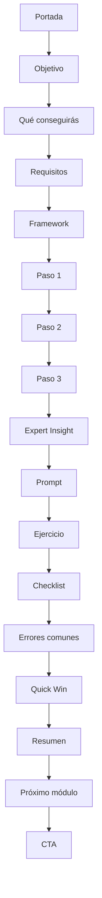

# Modo Guías PDF — CEINCA Editorial System™

Este modo aplica SOLO a documentos largos tipo manual/guía/playbook (PDF educativos, cursos, sistemas de trabajo). Para carruseles, posts, landing pages y artifacts de marketing usa el modo Social/Redes del `SKILL.md` principal + `components.md`/`tokens.md` — **no mezcles las dos paletas dentro de la misma pieza.**

## Cuándo usar este modo vs. el modo Social/Redes

| Si es... | Usa |
|---|---|
| Carrusel IG, post, Reel/Story, landing, banner | Modo Social/Redes (Navy `#122A63` + Dorado `#C8A951` + Montserrat) |
| Guía PDF, manual, playbook, curso, sistema de trabajo, documento de entrenamiento largo | Este modo (Azul `#1E3A8A` + Manrope) |

Ambos modos son la misma marca CEINCA en dos registros distintos — no se reemplazan entre sí. Nunca uses Manrope en un carrusel ni Montserrat en una guía PDF.

## Posicionamiento del formato

No es una colección de PDFs — es un **sistema editorial**. Cualquier página, sin logo visible, debe ser reconocible como CEINCA por su estructura y componentes, no solo por color.

Inspiración de referencia (adaptar, nunca copiar): Apple Human Interface, Stripe Docs, Linear, Notion, Vercel, Arc Browser, GitHub Docs — combinado con un registro jurídico-moderno. Objetivo: que se vea como empresa tecnológica especializada en soluciones legales, no como despacho de abogados tradicional (nada de balanzas, martillos, columnas griegas).

**Nota sobre rigor vs. simplicidad:** el objetivo es comunicar método y precisión, no dificultar la lectura. Rigor y claridad no compiten — Stripe/Linear/Notion logran ambas a la vez. Si una página es difícil de entender, no se percibe "más profesional", se percibe mal escrita.

## Paleta — Modo Guías

```
PRIMARIO
  Azul CEINCA        #1E3A8A   — Títulos, elementos de marca (del logo)
  Azul Oscuro        #122A63   — Encabezados, botones, tablas
  Azul Claro         #2D4FA8   — Destacados, etiquetas, gráficos
  Azul Muy Claro     #EAF0FF   — Fondos de módulos/cajas

NEUTROS
  Gris Oscuro        #22252A   — Texto principal
  Gris Medio         #666B76   — Texto secundario
  Gris Claro         #E8EAF1   — Divisores
  Blanco             #FFFFFF

ESTADO (uso funcional únicamente, nunca decorativo)
  Éxito              #00A86B   — Checklists completados
  Advertencia        #F59E0B   — Common Mistake
  Error              #D64545   — Alertas críticas
```

## Tipografía — Modo Guías

- **Principal:** Manrope (moderna, legible, técnica) — pesos 400/600/700/800.
- **Alternativa:** Inter (si Manrope no carga).
- **Monoespaciada:** JetBrains Mono — SOLO para bloques de prompt.

## Escala tipográfica y jerarquía

| Nivel | Tamaño | Peso | Color |
|---|---|---|---|
| Título | 48px | Bold | Azul CEINCA `#1E3A8A` |
| Capítulo | 34px | Semibold | Gris Oscuro |
| Sección | 26px | Semibold | Gris Oscuro |
| Subtítulo | 20px | Medium | Gris Oscuro |
| Texto | 16px | Regular | Gris Oscuro, line-height 1.6 |
| Notas | 14px | Regular | Gris Medio |

Máximo 3 niveles de jerarquía visual por página.

## Grid y formato

```
Formato:            A4 vertical
Márgenes:            32px
Sistema de columnas: 12
Espaciado base:       8px
```

## REGLA DURA — cómo evitar texto descentrado/pegado al fondo de color

Este es el error más común en los bloques de color (Expert Insight, Prompt Block, AI Insight, etc.) y tiene 3 causas. Aplica SIEMPRE las tres, sin excepción:

1. **Padding simétrico mínimo 24px en los 4 lados** (nunca padding solo vertical u horizontal; nunca menos de 24px en ningún lado).
2. **Line-height 1.5–1.6 en el cuerpo de texto** dentro de cajas de color — line-height 1.0–1.2 es lo que hace que el texto se vea "pegado" al borde superior/inferior de la caja.
3. **Centrado vertical con flexbox, nunca con padding manual calculado a ojo:**
   ```css
   .info-box {
     display: flex;
     align-items: center;   /* centra verticalmente el contenido, no lo dejes flotando arriba */
     gap: 16px;
     padding: 24px 28px;    /* simétrico, nunca asimétrico */
     line-height: 1.6;
   }
   ```
4. Verificación antes de exportar: en cada bloque de color, el espacio entre el texto y el borde superior debe ser visualmente igual al espacio entre el texto y el borde inferior. Si no lo es a simple vista, el padding o el centrado están mal — corrige antes de entregar, no lo dejes "casi bien".

## Componentes (usar únicamente estos en guías)

Cada uno con su función y regla de color/padding:

| Componente | Función | Fondo |
|---|---|---|
| **Hero Block** | Número de módulo + nombre + beneficio principal | Azul CEINCA, texto blanco |
| **Objective Block** | Qué aprenderá el lector | Azul Muy Claro |
| **Requirements Block** | Qué necesita antes de empezar | Blanco con borde gris claro |
| **Framework Block** | Explica la metodología del módulo | Blanco, título en Azul CEINCA |
| **Expert Insight** | Recomendación estratégica | Caja azul (`#EAF0FF` fondo, borde `#1E3A8A`) |
| **AI Insight** | Cómo razona la IA en este paso | Caja gris (`#E8EAF1`) |
| **Common Mistake** | Errores frecuentes | Caja con acento Advertencia `#F59E0B` |
| **Pro Tip** | Truco avanzado | Caja Azul Oscuro `#122A63`, texto blanco |
| **Prompt Block** | Prompt copiable | Fondo Gris Oscuro `#22252A`, tipografía JetBrains Mono, botón "Copiar Prompt" |
| **Exercise** | Ejercicio práctico | Blanco con borde punteado |
| **Checklist** | Checklist accionable | Blanco, marcas en Éxito `#00A86B` |
| **Quick Win** | Acción de <10 min | Caja compacta, acento dorado o azul claro |
| **Summary** | Resumen visual del módulo | Azul Muy Claro |
| **Next Module** | Continuidad al siguiente módulo | Azul CEINCA, CTA visible |

Todos los componentes de caja de color siguen la regla dura de la sección anterior sin excepción.

## Arquitectura de página (flujo obligatorio, no te saltes pasos)



## Encabezado y pie de página (obligatorio en cada página)

```
━━━━━━━━━━━━━━━━━━━━━━━━━━━━━━
CEINCA [NOMBRE DEL SISTEMA]™
Módulo 0X — [Nombre del módulo]
━━━━━━━━━━━━━━━━━━━━━━━━━━━━━━
```

Pie:
```
CEINCA®
Centro de Estudios e Investigación de Ciencias Administrativas
www.ceinca.com          Página 0X
```

## Criterio de nomenclatura propietaria (con límite)

Usa nombres propios (™) SOLO para metodologías genuinamente propias de CEINCA (ej. NEAPS+AIDA, Growth Engineering, CEINCA Deep Scan si es un proceso propio documentado). **No renombres términos universales que el lector ya conoce** (SEO, análisis, contenido) solo por sonar a propiedad intelectual — eso agrega fricción de traducción sin ganancia real de claridad. Regla práctica: si tienes que explicar qué significa el nombre propietario la primera vez que aparece, es candidato válido a trademark; si el lector ya entendía el término genérico igual de bien, déjalo en su nombre normal.

## Arquitectura de marca (paraguas)

- **CEINCA Frameworks™** — metodologías (ej. NEAPS+AIDA, Growth Engineering)
- **CEINCA Playbooks™** — colecciones de guías prácticas
- **CEINCA Systems™** — sistemas completos de trabajo (ej. este documento pertenece aquí: *CEINCA Systems™ — Editorial Guides*)
- **CEINCA AI™** — recursos y metodologías basadas en IA

Todo documento nuevo debe ubicarse explícitamente en una de estas cuatro categorías en su portada — nunca crear una marca aislada nueva (el error que corregimos en el sistema de auditoría de redes).

## Checklist antes de exportar cualquier guía

- [ ] ¿Usé Azul/Manrope (nunca Navy/Dorado/Montserrat mezclado en la misma pieza)?
- [ ] ¿Cada caja de color tiene padding simétrico ≥24px y centrado por flexbox?
- [ ] ¿Line-height ≥1.5 en todo texto dentro de cajas de color?
- [ ] ¿Máximo 3 niveles de jerarquía por página?
- [ ] ¿Cada página respeta el flujo obligatorio de arquitectura?
- [ ] ¿Encabezado y pie de página presentes?
- [ ] ¿Los nombres propietarios son metodologías reales, no términos genéricos disfrazados?
- [ ] ¿El documento se ubica en Frameworks/Playbooks/Systems/AI en la portada?
